# Database Structure - Prop-Tech va TroUyTin

Tai lieu nay mo ta cau truc database hien tai cua 2 he thong trong workspace:

- `Prop-Tech/Prop-Tech/backend`: backend .NET + Entity Framework Core + SQL Server.
- `TroUyTin/backend`: backend Spring Boot + JPA validate + Flyway migrations + SQL Server.

Nguon doc chinh:

- `Prop-Tech/Prop-Tech/backend/Data/ApplicationDbContext.cs`
- `Prop-Tech/Prop-Tech/backend/Models/*.cs`
- `TroUyTin/backend/src/main/resources/db/migration/V1__init_trouytin_schema.sql`
- `TroUyTin/backend/src/main/resources/db/migration/V2__auth_and_messaging_metadata.sql`
- `TroUyTin/backend/src/main/resources/db/migration/V3__fix_nullable_email_unique_index.sql`
- `TroUyTin/backend/src/main/resources/db/migration/V4__admin_listing_moderation.sql`

## Cach Doc Nhanh

- Ten bang/cot trong tai lieu la ten that trong database.
- `PK` la khoa chinh.
- `FK` la khoa ngoai.
- `JSON text` la cot luu JSON dang chuoi, thuong la `nvarchar(max)`.
- Prop-Tech tach du lieu theo chu nha bang `OWNER_USER_ID` / `owner_user_id`.
- TroUyTin lien ket voi Prop-Tech bang public id dang `post-{BAI_DANG_ID}`, khong dung FK truc tiep sang database Prop-Tech.

---

# 1. Prop-Tech Database

## 1.1 So Do Tong Quan

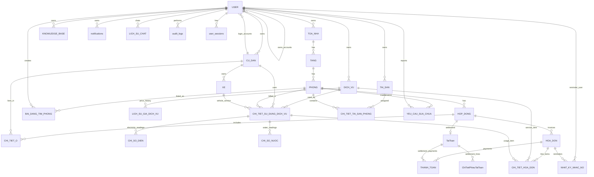

## 1.2 Nguyen Tac Phan Quyen Theo Chu Nha

Prop-Tech dang la he thong multi-owner. Cac owner/admin quan ly du lieu rieng thong qua `OwnerUserId`.

| Bang | Cot owner truc tiep | Ghi chu |
| --- | --- | --- |
| `USER` | `OWNER_USER_ID` | Tai khoan nhan vien/cu dan co the tro ve chu nha/admin owner. |
| `TOA_NHA` | `OWNER_USER_ID` | Goc tach du lieu phong tro theo chu nha. |
| `CU_DAN` | `OWNER_USER_ID` | Ho so cu dan thuoc chu nha nao. |
| `DICH_VU` | `OWNER_USER_ID` | Danh muc dich vu rieng theo chu nha. |
| `TAI_SAN` | `OWNER_USER_ID` | Danh muc tai san rieng theo chu nha. |
| `KNOWLEDGE_BASE` | `OWNER_USER_ID` | Noi dung chatbot/AI rieng theo chu nha. |
| `notifications` | `owner_user_id` | Thong bao admin/in-app tach theo chu nha. |

Nhung bang khong co owner truc tiep se lay owner qua quan he:

- `TANG`, `PHONG` -> `TOA_NHA.OWNER_USER_ID`.
- `HOP_DONG`, `HOA_DON`, `CHI_TIET_HOA_DON`, `THANH_TOAN` -> `PHONG`/`HOP_DONG`.
- `CHI_SO_DIEN`, `CHI_SO_NUOC` -> `CHI_TIET_SU_DUNG_DICH_VU` -> `PHONG` hoac `DICH_VU`.
- `BAI_DANG_TIM_PHONG` -> `PHONG` va `TAO_BOI_ID`.

## 1.3 Nhom Ha Tang Phong Tro

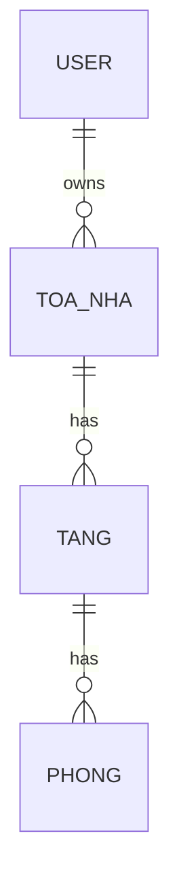

| Bang | PK | FK | Cot chinh |
| --- | --- | --- | --- |
| `TOA_NHA` | `TOA_NHA_ID` | `OWNER_USER_ID` -> `USER.USER_ID` | `TEN_TOA_NHA`, `DIA_CHI`, `SO_TANG`, `MO_TA`, `OWNER_USER_ID` |
| `TANG` | `TANG_ID` | `TOA_NHA_ID` -> `TOA_NHA.TOA_NHA_ID` | `SO_TANG` |
| `PHONG` | `PHONG_ID` | `TANG_ID` -> `TANG.TANG_ID` | `MA_PHONG`, `DIEN_TICH`, `SO_NGUOI_TOI_DA`, `DON_GIA_THUE_MAC_DINH`, `TRANG_THAI`, `LOAI_PHONG`, `ANH_PHONG_JSON`, `TIEN_NGHI_JSON`, `DICH_VU_JSON` |

Rang buoc/index:

- `TOA_NHA`: unique `OWNER_USER_ID + TEN_TOA_NHA`.
- `TANG`: unique `TOA_NHA_ID + SO_TANG`.
- `PHONG`: unique `TANG_ID + MA_PHONG`.

Ghi chu:

- `PHONG.ANH_PHONG_JSON`, `PHONG.TIEN_NGHI_JSON`, `PHONG.DICH_VU_JSON` la JSON text.
- `PHONG.LOAI_PHONG` hien dung cac gia tri nhu `single`, `apartment`.
- `PHONG.TRANG_THAI` hien dung cac gia tri nhu `Trong`, `Da thue`, `Bao tri`, `Khac`.

## 1.4 Nhom User, Cu Dan, Hop Dong

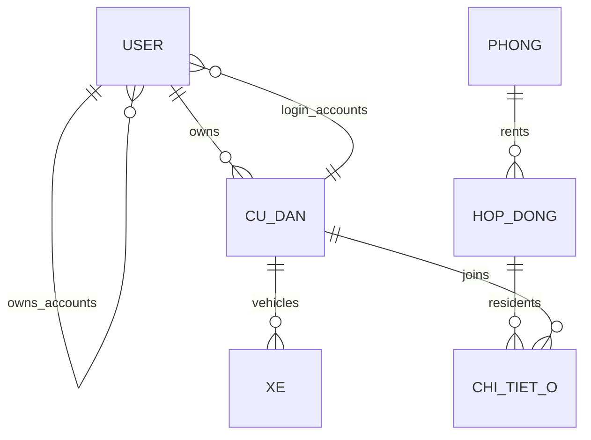

| Bang | PK | FK | Cot chinh |
| --- | --- | --- | --- |
| `USER` | `USER_ID` | `CU_DAN_ID` -> `CU_DAN.CU_DAN_ID`, `OWNER_USER_ID` -> `USER.USER_ID` | `SO_DIEN_THOAI`, `MAT_KHAU_HASH`, `VAI_TRO`, `TEN_HIEN_THI`, `EMAIL`, `ADDRESS`, `AVATAR_URL`, `IS_LOCKED`, `MUST_CHANGE_PASSWORD`, `LAST_LOGIN_AT`, `REFRESH_TOKEN`, `REFRESH_TOKEN_EXPIRY_TIME` |
| `CU_DAN` | `CU_DAN_ID` | `OWNER_USER_ID` -> `USER.USER_ID` | `HO_TEN`, `SO_DIEN_THOAI`, `SO_CCCD`, `QUE_QUAN`, `CCCD_FRONT_URL`, `CCCD_BACK_URL` |
| `HOP_DONG` | `HOP_DONG_ID` | `PHONG_ID` -> `PHONG.PHONG_ID` | `MA_HOP_DONG`, `NGAY_BAT_DAU`, `NGAY_KET_THUC_DU_KIEN`, `GIA_THUE_THUC_TE`, `TIEN_COC`, `NGAY_THANH_TOAN_HANG_THANG`, `CONG_THUC_HOA_DON_JSON` |
| `CHI_TIET_O` | `HOP_DONG_ID + CU_DAN_ID` | `HOP_DONG_ID` -> `HOP_DONG.HOP_DONG_ID`, `CU_DAN_ID` -> `CU_DAN.CU_DAN_ID` | `VAI_TRO_O`, `TU_NGAY`, `DEN_NGAY` |
| `XE` | `XE_ID` | `CU_DAN_ID` -> `CU_DAN.CU_DAN_ID` | `BIEN_SO`, `LOAI_XE`, `NGAY_DANG_KY`, `NGAY_HUY` |

Rang buoc/index:

- `USER.SO_DIEN_THOAI` unique.
- `USER.OWNER_USER_ID` co index.
- `CU_DAN.SO_CCCD` unique.
- `XE.BIEN_SO` unique.

Ghi chu:

- `USER.TEN_HIEN_THI` la ten hien thi cua chu nha/admin/user, dung de dong bo sang TroUyTin khi can hien thi thong tin chu nha.
- `USER.OWNER_USER_ID` dung de gan tai khoan con/nhan vien/cu dan vao chu nha.

## 1.5 Nhom Bai Dang Tim Phong / Dang Phong

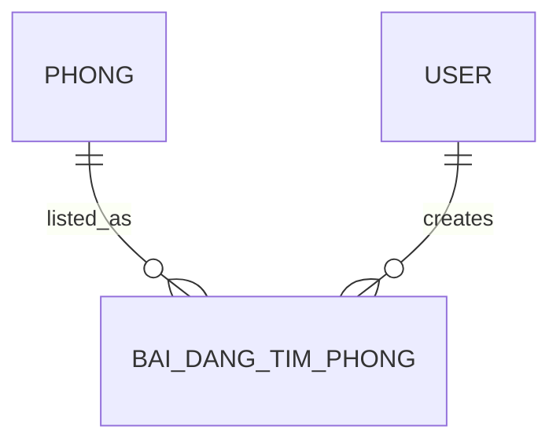

| Bang | PK | FK | Cot chinh |
| --- | --- | --- | --- |
| `BAI_DANG_TIM_PHONG` | `BAI_DANG_ID` | `PHONG_ID` -> `PHONG.PHONG_ID`, `TAO_BOI_ID` -> `USER.USER_ID` | `MA_PHONG`, `TEN_TOA_NHA`, `SO_TANG`, `DIEN_TICH`, `SO_NGUOI_TOI_DA`, `SO_NGUOI_DANG_O`, `TIEU_DE`, `GIA_THUE`, `NGAY_DANG`, `NGAY_TAO`, `LUOT_XEM`, `TIN_NHAN`, `IS_LOCKED`, `TRANG_THAI_BAI_DANG`, `TRANG_THAI_PHONG`, `KIEU_VAO_O`, `NGAY_CO_THE_VAO_O`, `CO_VUNG_NGAP_LUT`, `YEU_CAU_CHU_NHA`, `KIEU_LIEN_HE`, `TEN_LIEN_HE`, `SO_DIEN_THOAI`, `DICH_VU_JSON`, `ANH_JSON`, `TIEN_NGHI_JSON`, `ANH_BIA_URL` |

Rang buoc/index:

- Index `PHONG_ID`.
- Index `NGAY_TAO`.

Ghi chu:

- Bang nay la snapshot bai dang. Nhieu cot duplicate tu `PHONG` de public nhanh va giu trang thai tai thoi diem dang.
- `SO_DIEN_THOAI` trong bang bai dang la so lien he cua bai dang. Public/TroUyTin co the hien thi so nay thay vi so tai khoan owner.
- `DICH_VU_JSON`, `ANH_JSON`, `TIEN_NGHI_JSON` la JSON text.

## 1.6 Nhom Dich Vu Va Chi So Dien Nuoc

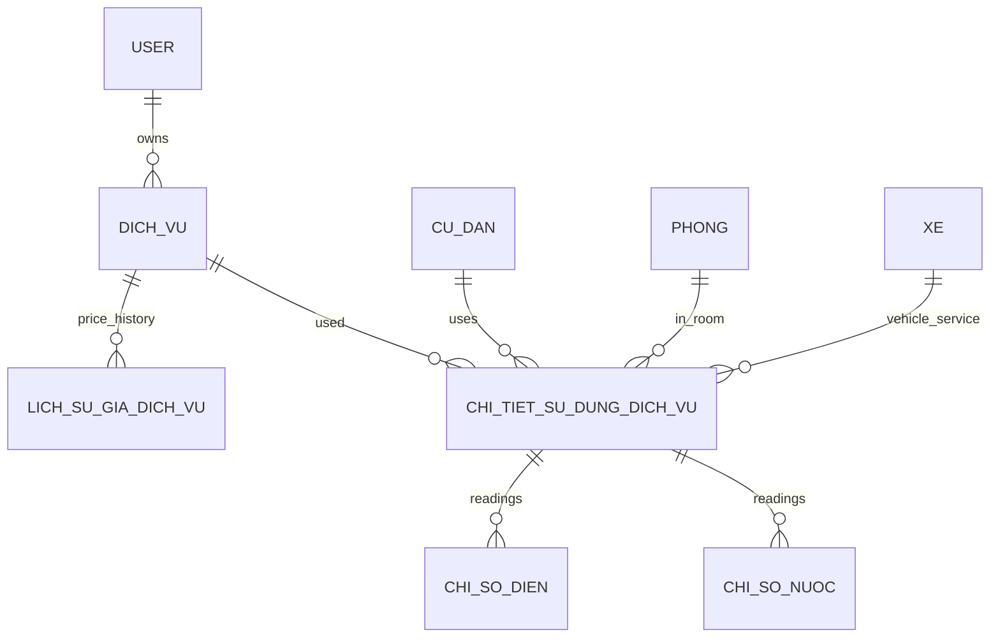

| Bang | PK | FK | Cot chinh |
| --- | --- | --- | --- |
| `DICH_VU` | `DICH_VU_ID` | `OWNER_USER_ID` -> `USER.USER_ID` | `TEN_DICH_VU`, `LOAI`, `DON_VI`, `DON_GIA_CHUNG`, `NGAY_AP_DUNG`, `IS_ACTIVE` |
| `LICH_SU_GIA_DICH_VU` | `ID` | `DICH_VU_ID` -> `DICH_VU.DICH_VU_ID` | `GIA_CU`, `GIA_MOI`, `NGAY_AP_DUNG`, `LY_DO`, `NGAY_THAY_DOI` |
| `CHI_TIET_SU_DUNG_DICH_VU` | `CT_SDDV_ID` | `DICH_VU_ID`, `CU_DAN_ID`, `PHONG_ID`, `XE_ID` | `AP_DUNG_TU`, `AP_DUNG_DEN`, `OVERRIDE_DON_GIA`, `SO_LUONG`, `GHI_CHU`, `CREATED_AT` |
| `CHI_SO_DIEN` | `CHI_SO_DIEN_ID` | `CT_SDDV_ID` -> `CHI_TIET_SU_DUNG_DICH_VU.CT_SDDV_ID`, `CREATED_BY` -> `USER.USER_ID` | `KY_THANG`, `KY_NAM`, `CHI_SO_MOI`, `IS_ANOMALY`, `ANOMALY_NOTE`, `ANH_DONG_HO_URL`, `CREATED_AT` |
| `CHI_SO_NUOC` | `CHI_SO_NUOC_ID` | `CT_SDDV_ID` -> `CHI_TIET_SU_DUNG_DICH_VU.CT_SDDV_ID`, `CREATED_BY` -> `USER.USER_ID` | `KY_THANG`, `KY_NAM`, `CHI_SO_MOI`, `IS_ANOMALY`, `ANOMALY_NOTE`, `ANH_DONG_HO_URL`, `CREATED_AT` |

Rang buoc/index:

- `DICH_VU`: unique `OWNER_USER_ID + TEN_DICH_VU`.
- `CHI_SO_DIEN`: unique `CT_SDDV_ID + KY_THANG + KY_NAM`.
- `CHI_SO_NUOC`: unique `CT_SDDV_ID + KY_THANG + KY_NAM`.
- `CHI_TIET_SU_DUNG_DICH_VU.XE_ID` chi dung cho dich vu gui xe.

## 1.7 Nhom Hoa Don, Thanh Toan, Tat Toan

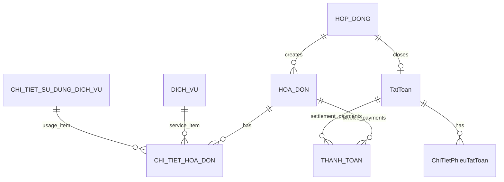

| Bang | PK | FK | Cot chinh |
| --- | --- | --- | --- |
| `HOA_DON` | `HOA_DON_ID` | `HOP_DONG_ID` -> `HOP_DONG.HOP_DONG_ID`, `APPROVED_BY` -> `USER.USER_ID` | `THANG`, `NAM`, `TONG_TIEN`, `TRANG_THAI`, `QR_CODE_URL`, `DUE_DATE`, `APPROVED_AT`, `REJECTED_REASON` |
| `CHI_TIET_HOA_DON` | `CHI_TIET_ID` | `HOA_DON_ID`, `CT_SDDV_ID`, `DICH_VU_ID` | `LOAI_KHOAN`, `SO_LUONG`, `DON_GIA`, `MO_TA` |
| `THANH_TOAN` | `THANH_TOAN_ID` | `HOA_DON_ID` hoac `TAT_TOAN_ID` | `LOAI`, `SO_TIEN`, `MA_GIAO_DICH`, `NOI_DUNG_CHUYEN_KHOAN`, `PAID_AT`, `STATUS`, `CREATED_AT` |
| `TatToan` | `Id` | `ResidencyId` -> `HOP_DONG.HOP_DONG_ID` | `SettlementDate`, `DepositRefund`, `OutstandingDebt`, `Compensation`, `Deductions`, `TotalSettlement`, `ResidentSignature`, `ManagerSignature`, `Status`, `CreatedAt`, `UpdatedAt` |
| `ChiTietPhieuTatToan` | `Id` | `SettlementId` -> `TatToan.Id` | `Description`, `Amount`, `Type`, `CreatedAt` |

Rang buoc/index:

- `HOA_DON`: unique `HOP_DONG_ID + THANG + NAM`.
- `THANH_TOAN` co check constraint `CHK_THANH_TOAN_REF`: moi dong chi duoc gan voi 1 trong 2 loai, hoac hoa don hoac tat toan.

Trang thai hoa don code dang dung:

- `Nhap`
- `Da phe duyet`
- `Chua thanh toan`
- `Da thanh toan mot phan`
- `Da thanh toan`
- `Qua han`
- `Bi tu choi`

## 1.8 Nhom Tai San Va Bao Tri

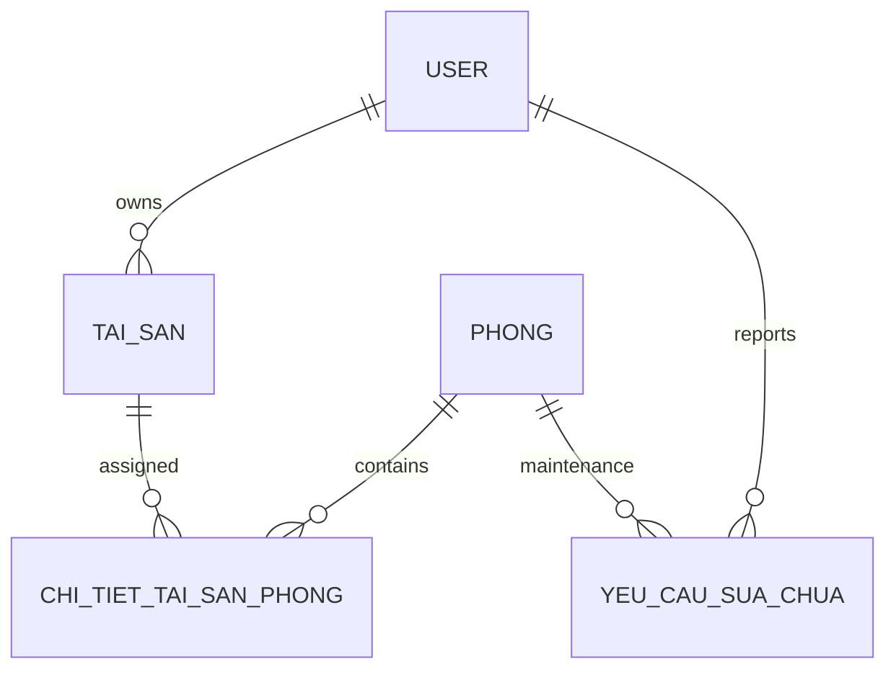

| Bang | PK | FK | Cot chinh |
| --- | --- | --- | --- |
| `TAI_SAN` | `TAI_SAN_ID` | `OWNER_USER_ID` -> `USER.USER_ID` | `TEN_TAI_SAN`, `MA_TAI_SAN` |
| `CHI_TIET_TAI_SAN_PHONG` | `PHONG_ID + TAI_SAN_ID` | `PHONG_ID` -> `PHONG.PHONG_ID`, `TAI_SAN_ID` -> `TAI_SAN.TAI_SAN_ID` | `SO_LUONG`, `TINH_TRANG`, `GHI_CHU` |
| `YEU_CAU_SUA_CHUA` | `YEU_CAU_ID` | `PHONG_ID` -> `PHONG.PHONG_ID`, `USER_ID` -> `USER.USER_ID` | `LOAI_SU_CO`, `MO_TA`, `MEDIA_URL`, `TRANG_THAI`, `GHI_CHU_ADMIN`, `COMPLETION_IMAGE_URL`, `CREATED_AT`, `UPDATED_AT`, `CLOSED_AT` |

Rang buoc/index:

- `TAI_SAN`: unique `OWNER_USER_ID + MA_TAI_SAN`.
- `CHI_TIET_TAI_SAN_PHONG`: composite PK `PHONG_ID + TAI_SAN_ID`.

## 1.9 Nhom Chatbot, Thong Bao, Audit, Session

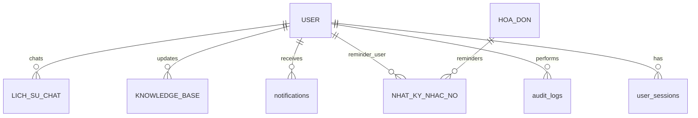

| Bang | PK | FK | Cot chinh |
| --- | --- | --- | --- |
| `LICH_SU_CHAT` | `CHAT_ID` | `USER_ID` -> `USER.USER_ID` | `MESSAGE_ROLE`, `MESSAGE_TEXT`, `IS_KNOWLEDGE_GAP`, `CREATED_AT` |
| `KNOWLEDGE_BASE` | `KB_ID` | `UPDATED_BY` -> `USER.USER_ID`, `OWNER_USER_ID` -> `USER.USER_ID` | `TIEU_DE`, `NOI_DUNG`, `THE_LOAI`, `TAGS`, `IS_ACTIVE`, `UPDATED_AT` |
| `notifications` | `id` | `user_id` -> `USER.USER_ID`, `owner_user_id` -> `USER.USER_ID` | `recipient_id`, `scope_type`, `scope_id`, `notification_type`, `title`, `content`, `priority`, `link_url`, `related_id`, `is_read`, `read_at`, `sent_at`, `created_at` |
| `NHAT_KY_NHAC_NO` | `NHAC_NO_ID` | `HOA_DON_ID`, `SENT_TO_USER_ID`, `SENT_BY_USER_ID` | `LAN_NHAC`, `NHAC_LUC`, `HINH_THUC`, `NOI_DUNG`, `TRANG_THAI_GUI`, `ERROR_MESSAGE` |
| `audit_logs` | `id` | `user_id` -> `USER.USER_ID` | `action`, `entity_type`, `entity_id`, `old_values`, `new_values`, `ip_address`, `user_agent`, `created_at` |
| `blocked_ips` | `id` | - | `ip_address`, `reason`, `blocked_at`, `expires_at`, `blocked_by`, `is_active`, `created_at` |
| `user_sessions` | `id` | `user_id` -> `USER.USER_ID` | `refresh_token`, `device_info`, `ip_address`, `expires_at`, `created_at`, `revoked_at` |

Ghi chu:

- `notifications.scope_type` hien dung cac scope nhu `USER`, `ROOM`, `FLOOR`, `BUILDING`, `ALL`, `ADMIN`.
- `notifications.owner_user_id` bat buoc can duoc filter trong API admin de tranh thay thong bao cua chu nha khac.
- `audit_logs.old_values` va `audit_logs.new_values` la JSON text.

## 1.10 Tong Hop Index/Rang Buoc Quan Trong Prop-Tech

| Bang | Rang buoc/index |
| --- | --- |
| `TOA_NHA` | unique `OWNER_USER_ID + TEN_TOA_NHA` |
| `TANG` | unique `TOA_NHA_ID + SO_TANG` |
| `PHONG` | unique `TANG_ID + MA_PHONG` |
| `CU_DAN` | unique `SO_CCCD` |
| `USER` | unique `SO_DIEN_THOAI`, index `OWNER_USER_ID` |
| `XE` | unique `BIEN_SO` |
| `BAI_DANG_TIM_PHONG` | index `PHONG_ID`, index `NGAY_TAO` |
| `DICH_VU` | unique `OWNER_USER_ID + TEN_DICH_VU` |
| `CHI_SO_DIEN` | unique `CT_SDDV_ID + KY_THANG + KY_NAM` |
| `CHI_SO_NUOC` | unique `CT_SDDV_ID + KY_THANG + KY_NAM` |
| `HOA_DON` | unique `HOP_DONG_ID + THANG + NAM` |
| `THANH_TOAN` | check `CHK_THANH_TOAN_REF` |
| `TAI_SAN` | unique `OWNER_USER_ID + MA_TAI_SAN` |
| `CHI_TIET_TAI_SAN_PHONG` | composite PK `PHONG_ID + TAI_SAN_ID` |
| `CHI_TIET_O` | composite PK `HOP_DONG_ID + CU_DAN_ID` |
| `notifications` | index `owner_user_id` |
| `KNOWLEDGE_BASE` | index `OWNER_USER_ID` |

---

# 2. TroUyTin Database

## 2.1 So Do Tong Quan

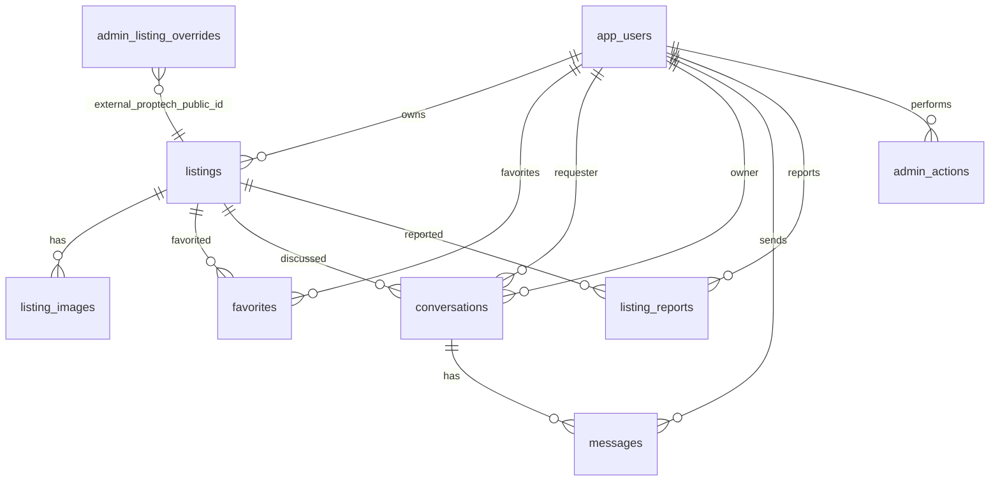

## 2.2 Nguon Schema Va Cach Tao DB

TroUyTin dung Flyway migrations. `spring.jpa.hibernate.ddl-auto=validate`, nghia la Hibernate chi validate schema, khong tu tao/sua bang.

Thu tu migration hien co:

| Migration | Noi dung |
| --- | --- |
| `V1__init_trouytin_schema.sql` | Tao bang user, listing, image, favorite, conversation, message, report, admin action. |
| `V2__auth_and_messaging_metadata.sql` | Bo sung metadata conversation/message de chat voi Prop-Tech va WebSocket. |
| `V3__fix_nullable_email_unique_index.sql` | Doi unique email thanh filtered unique index `email IS NOT NULL`. |
| `V4__admin_listing_moderation.sql` | Tao bang override trang thai duyet/an/xoa bai Prop-Tech tren admin TroUyTin. |

Database mac dinh theo config:

- JDBC URL: `jdbc:sqlserver://localhost:1433;databaseName=trouytin;encrypt=true;trustServerCertificate=true`
- Port API: `8090`

## 2.3 Nhom User Va Auth

| Bang | PK | FK | Cot chinh |
| --- | --- | --- | --- |
| `app_users` | `id` | - | `phone`, `email`, `full_name`, `password_hash`, `role`, `status`, `created_at`, `updated_at` |

Rang buoc/index:

- `app_users.phone` unique.
- `app_users.email` unique co dieu kien `email IS NOT NULL` qua index `ux_app_users_email_not_null`.

Ghi chu:

- `full_name` la ten hien thi nguoi dung TroUyTin/admin/chu nha khi dong bo hoac hien thi.
- `role` phan biet user/admin/super admin tuy theo code auth hien tai.

## 2.4 Nhom Listing Public

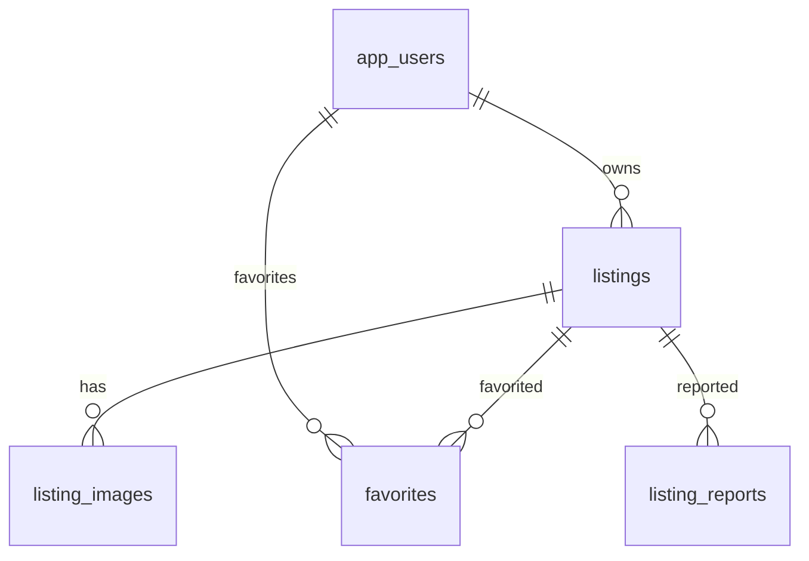

| Bang | PK | FK | Cot chinh |
| --- | --- | --- | --- |
| `listings` | `id` | `owner_user_id` -> `app_users.id` | `proptech_public_id`, `title`, `description`, `city`, `district`, `ward`, `address`, `price`, `area`, `listing_status`, `review_status`, `source`, `created_at`, `updated_at` |
| `listing_images` | `id` | `listing_id` -> `listings.id` | `image_url`, `sort_order` |
| `favorites` | `user_id + listing_id` | `user_id` -> `app_users.id`, `listing_id` -> `listings.id` | `created_at` |
| `listing_reports` | `id` | `listing_id` -> `listings.id`, `reporter_user_id` -> `app_users.id` | `reason`, `note`, `status`, `created_at`, `resolved_at` |

Rang buoc/index:

- `listings.proptech_public_id` unique.
- `favorites` composite PK `user_id + listing_id`.
- `listing_images.listing_id` cascade delete theo listing.
- `favorites.listing_id` cascade delete theo listing.
- `listing_reports.listing_id` cascade delete theo listing.

Ghi chu:

- `proptech_public_id` dung de lien ket bai dang Prop-Tech public, vi du `post-5`.
- `source` cho biet bai dang den tu TroUyTin hay Prop-Tech.
- `listing_status` va `review_status` dung cho vong doi hien thi/kiem duyet.

## 2.5 Nhom Conversation Va Message

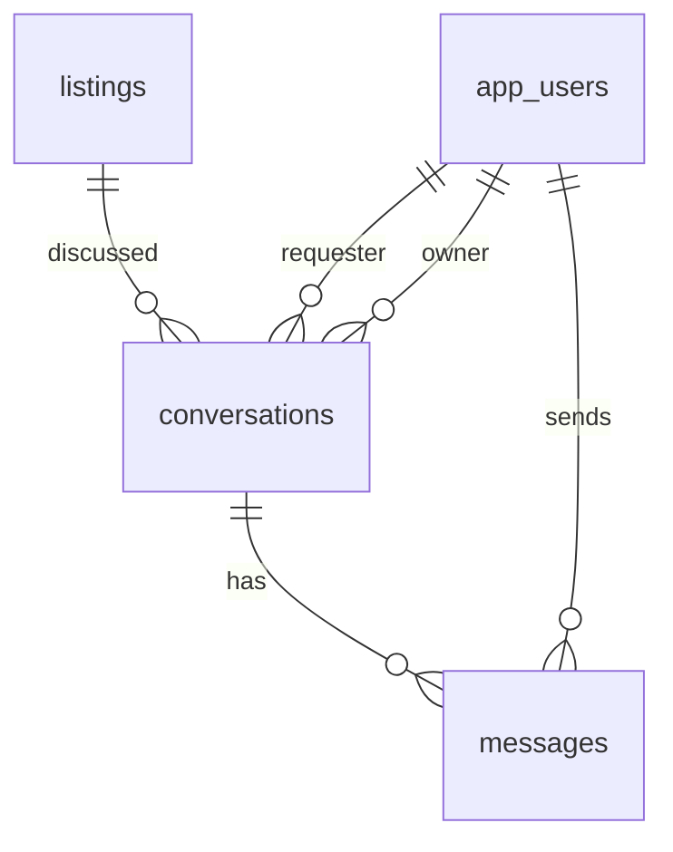

| Bang | PK | FK | Cot chinh |
| --- | --- | --- | --- |
| `conversations` | `id` | `listing_id` -> `listings.id`, `requester_user_id` -> `app_users.id`, `owner_user_id` -> `app_users.id` | `status`, `created_at`, `updated_at`, `proptech_room_id`, `room_title`, `partner_user_id`, `partner_name`, `partner_phone`, `partner_avatar`, `partner_role`, `last_read_at` |
| `messages` | `id` | `conversation_id` -> `conversations.id`, `sender_user_id` -> `app_users.id` nullable | `body`, `created_at`, `sender_type`, `sender_external_id`, `read_at` |

Rang buoc/index:

- `messages.conversation_id` cascade delete theo conversation.
- `ix_conversations_requester_updated` tren `requester_user_id, updated_at DESC`.
- `ix_conversations_proptech_partner` tren `partner_user_id, updated_at DESC`.
- `ix_messages_conversation_created` tren `conversation_id, created_at ASC`.

Ghi chu:

- `partner_user_id` la external id de Prop-Tech frontend lay hoi thoai cua dung chu nha/admin, khong phai FK database.
- `proptech_room_id` va `room_title` giu metadata bai/phong tu Prop-Tech.
- `messages.sender_user_id` co the null de chap nhan message den tu actor ngoai TroUyTin, khi do dung `sender_type` va `sender_external_id`.
- WebSocket hien publish theo conversation/user destination, DB van la nguon du lieu chinh.

## 2.6 Nhom Admin Va Moderation

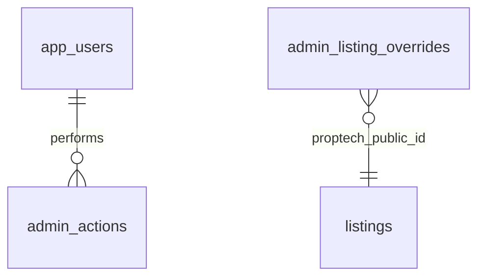

| Bang | PK | FK | Cot chinh |
| --- | --- | --- | --- |
| `admin_actions` | `id` | `admin_user_id` -> `app_users.id` | `action`, `target_type`, `target_id`, `note`, `created_at` |
| `admin_listing_overrides` | `id` | - | `proptech_public_id`, `review_status`, `public_status`, `approved_at`, `hidden_at`, `deleted_at`, `created_at`, `updated_at` |

Rang buoc/index:

- `admin_listing_overrides.proptech_public_id` unique.
- `ix_admin_listing_overrides_status` tren `review_status, public_status, deleted_at`.

Ghi chu:

- `admin_listing_overrides` khong co FK sang `listings` vi no co the dieu khien bai dang Prop-Tech theo public id truoc/sau khi dong bo vao TroUyTin.
- `public_status` dung de an/hien/xoa logic tren public TroUyTin.

## 2.7 Tong Hop Index/Rang Buoc Quan Trong TroUyTin

| Bang | Rang buoc/index |
| --- | --- |
| `app_users` | unique `phone`, filtered unique `email IS NOT NULL` |
| `listings` | unique `proptech_public_id`, FK `owner_user_id` |
| `listing_images` | FK `listing_id` cascade delete |
| `favorites` | composite PK `user_id + listing_id` |
| `conversations` | FK `listing_id`, `requester_user_id`, `owner_user_id`; index requester/update va proptech partner/update |
| `messages` | FK `conversation_id` cascade delete, `sender_user_id` nullable; index conversation/created |
| `listing_reports` | FK `listing_id` cascade delete |
| `admin_actions` | FK `admin_user_id` |
| `admin_listing_overrides` | unique `proptech_public_id`, index moderation status |

---

# 3. Lien Ket Du Lieu Giua Prop-Tech Va TroUyTin

## 3.1 Bai Dang / Listing

| Prop-Tech | TroUyTin | Ghi chu |
| --- | --- | --- |
| `BAI_DANG_TIM_PHONG.BAI_DANG_ID` | `listings.proptech_public_id` | Thuong map thanh chuoi `post-{BAI_DANG_ID}`. |
| `BAI_DANG_TIM_PHONG.TIEU_DE` | `listings.title` hoac API response public | Tieu de bai dang/phong. |
| `BAI_DANG_TIM_PHONG.GIA_THUE` | `listings.price` | Gia hien thi public. |
| `BAI_DANG_TIM_PHONG.DIEN_TICH` | `listings.area` | Dien tich public. |
| `BAI_DANG_TIM_PHONG.ANH_JSON` | `listing_images.image_url` hoac public response images | TroUyTin co bang anh rieng. |
| `BAI_DANG_TIM_PHONG.SO_DIEN_THOAI` | Host phone tren public listing | Day la so lien he cua bai dang. |
| `USER.TEN_HIEN_THI` | Host name / `app_users.full_name` khi dong bo | Ten chu nha nen lay tu account owner/admin. |

## 3.2 Tin Nhan

| Prop-Tech Frontend | TroUyTin DB | Ghi chu |
| --- | --- | --- |
| `partnerUserId` | `conversations.partner_user_id` | External id dai dien chu nha/admin Prop-Tech. |
| Tieu de phong/bai dang | `conversations.room_title` | Chi la metadata hien thi/tim kiem, khong phai FK bai dang. |
| Noi dung tin nhan | `messages.body` | Du lieu chinh nam trong TroUyTin DB. |
| Nguoi gui ngoai TroUyTin | `messages.sender_type`, `messages.sender_external_id` | Dung khi sender khong co `app_users.id`. |

## 3.3 Moderation Bai Prop-Tech Tren TroUyTin

| TroUyTin | Muc dich |
| --- | --- |
| `admin_listing_overrides.proptech_public_id` | Gan trang thai duyet/an/xoa cho bai Prop-Tech theo public id. |
| `admin_listing_overrides.review_status` | Trang thai kiem duyet admin. |
| `admin_listing_overrides.public_status` | Trang thai hien thi public. |
| `admin_actions` | Log thao tac admin voi listing/user/report. |

